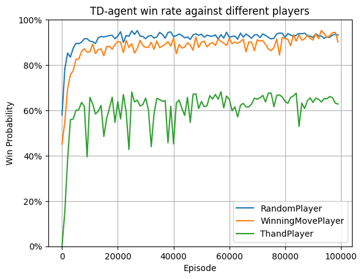

# Reinforcement Learning Fundamentals Repository

Welcome to the GitHub repository for the Reinforcement Learning Fundamentals coursework. In the first part, we develop a Tic-Tac-Toe agent using the Temporal Difference (TD) learning algorithm. This agent is trained to compete against several types of opponents: a random player, a winning-move player (who plays randomly unless a winning move is immediately available), and the ThandPlayer (who plays to win or block the opponent's winning move). In the second part, we explore the concept of exploration vs. exploitation in reinforcement learning by implementing a 10-armed bandit problem. We compare the performance of greedy and epsilon-greedy strategies, incorporating the Upper Confidence Bound (UCB) approach, and discuss the challenges of using the sample average update method in dynamic environments, which we address with an Exponentially Weighted Moving Average (EWMA).

## Part 1: Implementing the Tic-Tac-Toe Agent

For a comprehensive walkthrough of our Tic-Tac-Toe game implementation, please consult the Jupyter Notebook titled `tic-tac-toe.ipynb`. This notebook meticulously outlines the Tic-Tac-Toe board setup, initializes various player types (including TDAgent with parameters $\alpha=0.2$, $\epsilon_{0} = 1$, $\epsilon_{min} = 0.1$, RandomPlayer, WinningMovePlayer, ThandPlayer, and HumanPlayer), and trains three distinct TD agents against each specified player type. We then evaluate the performance of each TD agent in 1000 game matches against the three player types. A demonstration of the learning curve is below:

### Observations and Insights
To simplify our discussion, we refer to the agents as follows: Agent1 (trained against RandomPlayer), Agent2 (trained against WinningMovePlayer), and Agent3 (trained against ThandPlayer).
- Agents 1 and 2 exhibit rapid learning, achieving approximately a 90% win rate in evaluations of 1000 games within 20,000 training episodes. Agent 2's learning curve displays more variability than Agent 1's, even post-convergence, which aligns with expectations.
- Agent 3 shows a slower convergence rate, reaching a win rate of about 66% after 10,000 episodes, with notably fluctuating evaluation results.

After 10,000 episodes of training, we assessed each agent against the three player types, yielding the following indicative results (note that these outcomes can vary based on random seeds and provide only a general performance indicator):

**TDAgent (Trained against Random) vs. different players:**
- Wins against RandomPlayer: 945/1000, Draws: 18/1000, Losses: 37/1000
- Wins against WinningMovePlayer: 804/1000, Draws: 12/1000, Losses: 184/1000
- Wins against ThandPlayer: 508/1000, Draws: 62/1000, Losses: 430/1000

**TDAgent (Trained against WinningMove) vs. different players:**
- Wins against RandomPlayer: 957/1000, Draws: 22/1000, Losses: 21/1000
- Wins against WinningMovePlayer: 937/1000, Draws: 18/1000, Losses: 45/1000
- Wins against ThandPlayer: 245/1000, Draws: 418/1000, Losses: 337/1000

**TDAgent (Trained against ThandPlayer) vs. different players:**
- Wins against RandomPlayer: 802/1000, Draws: 21/1000, Losses: 177/1000
- Wins against WinningMovePlayer: 740/1000, Draws: 16/1000, Losses: 244/1000
- Wins against ThandPlayer: 626/1000, Draws: 14/1000, Losses: 360/1000

### Conclusions
- Agents 1 and 2 are highly effective against RandomPlayer and WinningMovePlayer but struggle significantly against ThandPlayer compared to Agent 3. This outcome is logical, given their training against simpler opponents.
- Agent 3, while slightly less dominant against RandomPlayer and WinningMovePlayer than Agents 1 and 2, performs markedly better against ThandPlayer. Despite a more erratic learning curve and slower convergence, Agent 3 consistently demonstrates strong performance across different player types. This is likely because defeating ThandPlayer requires the ability to simultaneously consider multiple winning moves, which is a skill that offers a significant competitive edge against other agent.

## Part 2: TBC

# Reference
- https://github.com/khpeek/Q-learning-Tic-Tac-Toe
- https://github.com/tansey/rl-tictactoe
- https://github.com/govindgnair23/RL_Exploration